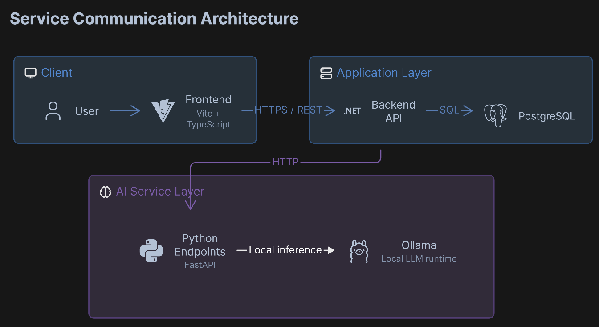

# Ledgr

<p align="center">
  
  
  
  
  
  
  
  
</p>

**Ledgr** is a fully local, fully free AI-assisted personal finance tracker. Paste bank statement text or upload a PDF statement, and a local LLM extracts structured transactions - date, merchant, amount, category - which the user reviews and confirms before anything is saved.

## Architecture Overview

<p align="center">
  
</p>

<p align="center">
  A user's browser talks to a .NET API, which delegates statement parsing to a Python FastAPI service. The Python service extracts text (directly, or from a PDF via pdfplumber) and prompts a local Ollama model to return structured transactions. The user reviews and edits the extracted results in the frontend before they're saved.
</p>

## What The Project Includes

- **Statement parsing service (Python FastAPI)** — exposes `/parse` (pasted text) and `/parse-pdf` (PDF upload) endpoints; owns all LLM extraction and PDF text extraction.
- **.NET backend** — owns routing, request validation, authentication, and transaction/budget storage; delegates parsing work to the Python service over HTTP.
- **React (Vite/TS) frontend** — paste/upload interface, an editable review table for confirming extracted transactions before saving, and a spending dashboard.
- **Local LLM via Ollama** — GPU-accelerated extraction with zero API cost and no external network dependency.

## Core Capabilities

- Extracts transactions from pasted statement text or uploaded PDF statements.
- Correctly parses DD/MM (Moldovan/European) date format, normalizes merchant name casing, and categorizes spending — including recognizing local merchants (e.g. Kaufland, Linella) that generic models often miss.
- Nothing is saved automatically — every extraction is reviewed and editable by the user first, since LLM extraction is treated as a first draft, not ground truth.
- Authenticated multi-user accounts with per-user transaction history and budgets.

## Tech Stack

- Backend: .NET, ASP.NET Core
- AI runtime: Python, FastAPI, pdfplumber, Ollama
- Frontend: React, TypeScript, Vite
- Data: PostgreSQL
- Local orchestration: Docker Compose
- LLM: Llama 3.1 8B, served locally via Ollama with GPU acceleration

## Quick Start

### Prerequisites

- Docker Desktop (with WSL2 backend on Windows; NVIDIA GPU passthrough recommended for faster generation)
- .NET SDK, if running the backend outside Docker
- Node.js 20+, if running the frontend outside Docker
- Python 3.11+, if running the parsing service outside Docker

### Recommended Local Startup

Docker Compose is the source of truth for the local topology and starts the full stack.

```bash
docker compose up -d --build
```

This provisions:

- PostgreSQL
- Ollama (GPU-accelerated local LLM)
- Python parsing service (FastAPI)
- .NET backend
- React frontend

### Manual Startup

Use this only when working on an isolated part of the stack.

```bash
cd ingestion
python -m venv .venv
source .venv/bin/activate      # .venv\Scripts\activate on Windows
pip install -r requirements.txt
uvicorn main:app --reload --port 8000
```

```bash
cd backend/Ledgr.Api
dotnet run
```

```bash
cd frontend
npm install
npm run dev
```

## Repository Layout

```text
ledgr/
├── frontend/       # React (Vite + TypeScript) client
├── backend/        # .NET API — routing, auth, transactions, budgets
├── ingestion/      # Python FastAPI service — statement parsing, PDF extraction, LLM calls
└── docs/           # Architecture diagrams and documentation assets
```

## Data Pipeline

1. User pastes statement text, or uploads a PDF statement.
2. If a PDF, `pdfplumber` extracts the transaction table and reformats it as plain text lines.
3. The statement text is sent to a local LLM (via Ollama), constrained to a structured JSON schema, which returns a list of candidate transactions with parsed dates, cleaned merchant names, and categories.
4. The user reviews and edits the candidate transactions in the frontend.
5. Confirmed transactions are saved to PostgreSQL, available for dashboards and budget tracking.

## Documentation

Further architecture and setup notes live in `docs/`.
